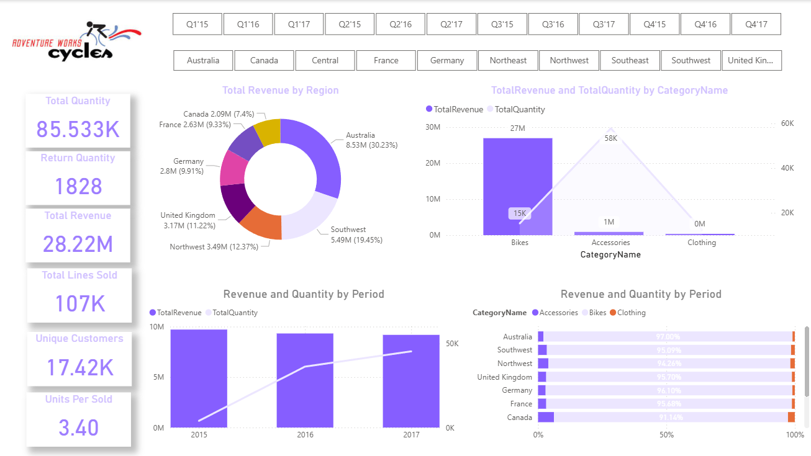
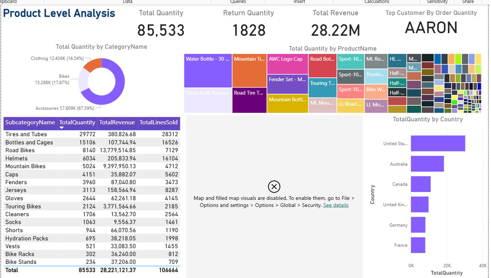

# 📊 Adventure Works Sales Dashboard

## Overview
This Power BI project analyzes sales performance, product distribution, and customer insights using the Adventure Works dataset.  
The dashboard is divided into two main views: overall sales performance and detailed product-level analysis.

---

## 📸 Dashboard Preview

### 🔹 Sales Overview Dashboard

### 🔹 Product Level Analysis Dashboard

---

## 📁 Files
- Adventure Works Sales Dashboard.pbix  
- Sales Data.xlsx  
- Dashboard_Page1.png  
- Dashboard_Page2.png  

---

## 🔍 Key Insights
- Total Revenue: 28.22M  
- Total Quantity Sold: 85K+  
- Accessories contribute the highest share in quantity  
- Bikes category generates maximum revenue  
- Australia and Southwest regions show strong performance  
- Top customer identified based on order quantity  

---

## 📊 Features

### Sales Overview Dashboard
- Revenue distribution by region  
- Category-wise comparison (Bikes, Accessories, Clothing)  
- Year-wise trends (2015–2017)  
- KPI cards (Revenue, Quantity, Customers)

### Product Level Analysis Dashboard
- Product-wise quantity distribution (treemap)  
- Subcategory performance table  
- Country-wise sales analysis  
- Top customer identification  

---

## 🛠 Tools Used
- Microsoft Power BI  
- Microsoft Excel  

---

## ▶️ How to Use
1. Download the `.pbix` file  
2. Open it in Power BI Desktop  
3. Use filters (year, region, category) to explore insights  

---

## 🎯 Project Objective
To convert raw sales data into actionable insights using interactive and visually appealing dashboards.

---

## 👤 Author
Naman Varshney
