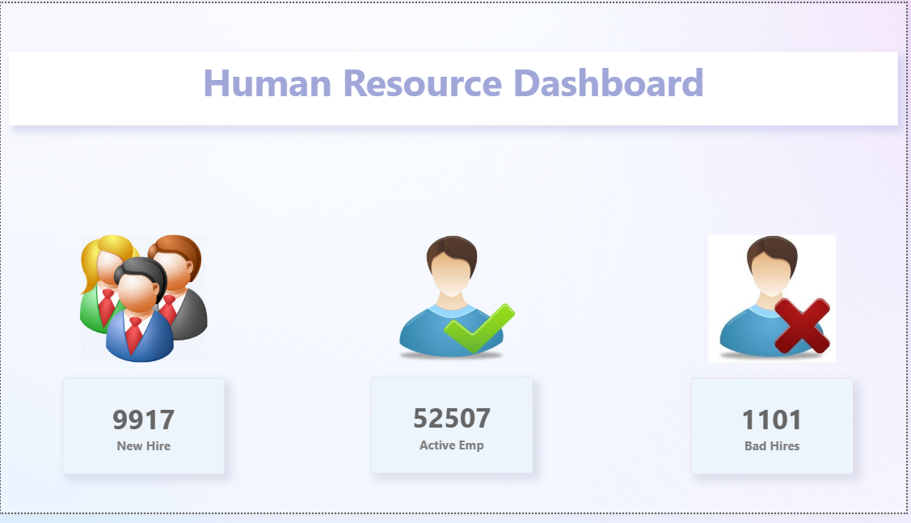
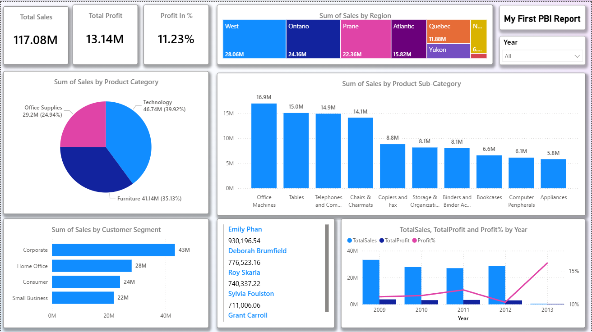

# 📊 Power BI Dashboards Portfolio

A collection of interactive Power BI dashboards built using real-world datasets.  
These projects demonstrate data analysis, visualization, and business insights.

---

## 🚀 Projects

### 🔹 Human Resource Dashboard
- Employee data analysis and HR insights  
- Attrition, performance, and workforce trends  
👉 [View Project](./Human_Resource_Dashboard)

---

### 🔹 Sales Dashboard
- Sales performance and trend analysis  
- Region-wise and product-level insights  
👉 [View Project](./PowerBI-Report)

---

## 🛠 Tools Used
- Microsoft Power BI  
- Microsoft Excel  

---

## 📸 Dashboard Previews

### Human Resource Dashboard

### Sales Dashboard

---

## 📌 How to Use
1. Open any project folder  
2. Download the `.pbix` file  
3. Open using Power BI Desktop  
4. Explore interactive dashboards  

---

## 👤 Author
**Naman Varshney**
